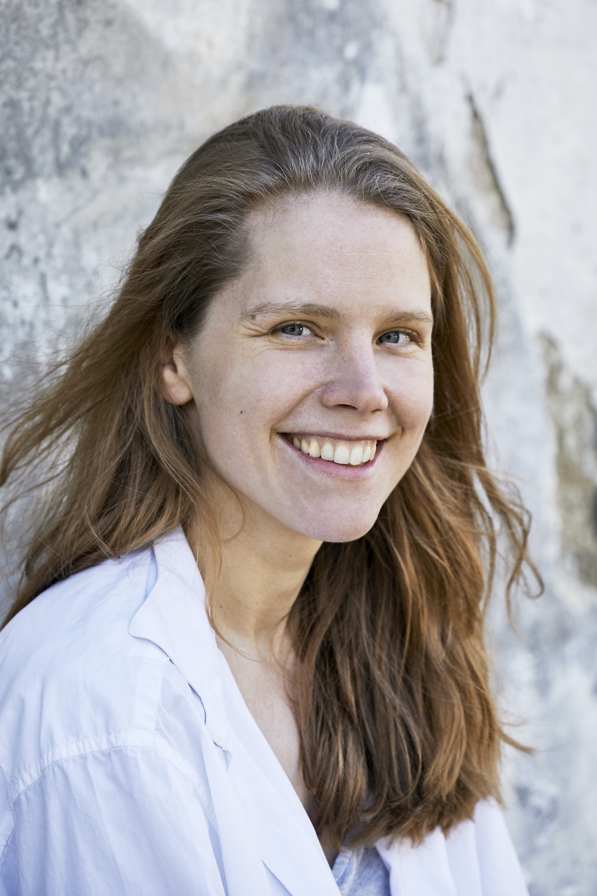

Katharina Ingrid Godler wurde 1991 in Wien Favoriten geboren. Sie studierte Vergleichende Literaturwissenschaft an der Universität Wien. An der Akademie der Wissenschaften (ÖAW) und an der Universität Klagenfurt (AAU) forschte sie zu Ilse Aichinger, Thomas Bernhard, Karl Kraus und Robert Musil. Sie lebt und arbeitet als Schriftstellerin in Klagenfurt am Wörthersee.

 

Verantwortlich für die Inhalte dieser Seite:

Katharina Godler 
Eppensteinerstraße 6 
9020 Klagenfurt 

+43 664 999 05 00 
<a href="katharina@godler.art">katharina@godler.art</a>
