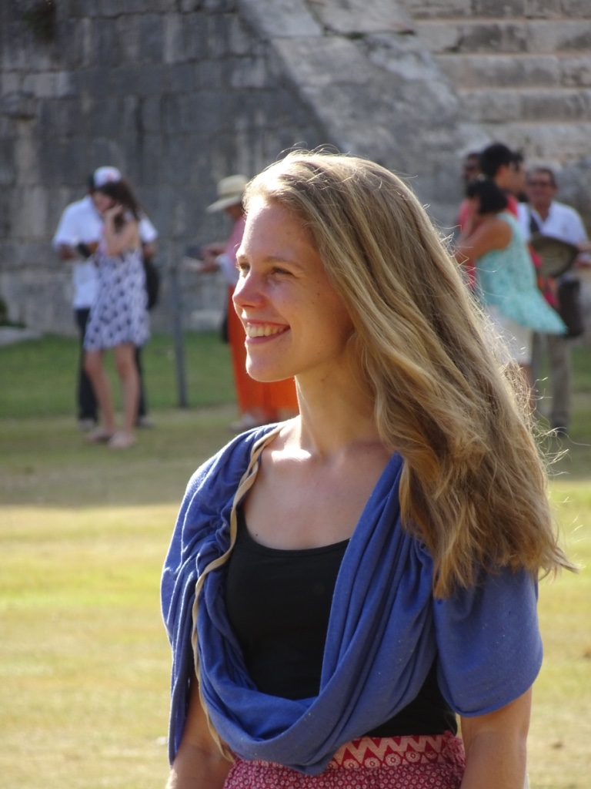

## Kurzbiographie

Katharina Ingrid Godler wurde 1991 in Wien Favoriten geboren. Sie studierte Vergleichende Literaturwissenschaft an der Universität Wien. An der Akademie der Wissenschaften (ÖAW) und an der Universität Klagenfurt (AAU) forschte sie zu Ilse Aichinger, Thomas Bernhard, Karl Kraus und Robert Musil. Sie lebt und arbeitet als Schriftstellerin in Klagenfurt am Wörthersee.

## Stipendien und Auszeichungen

14.02.2020

Arbeitsstipendium Literatur des BMKÖS Kunst und Kultur für das Romanprojekt „Die Gerlitzenwiege“

